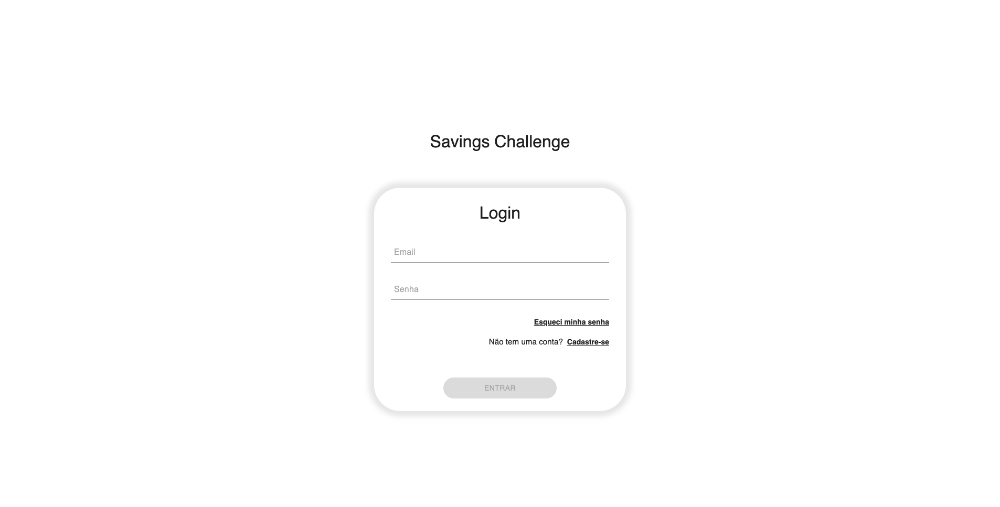
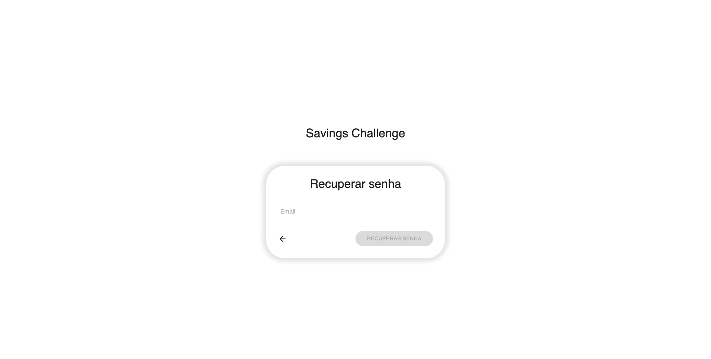
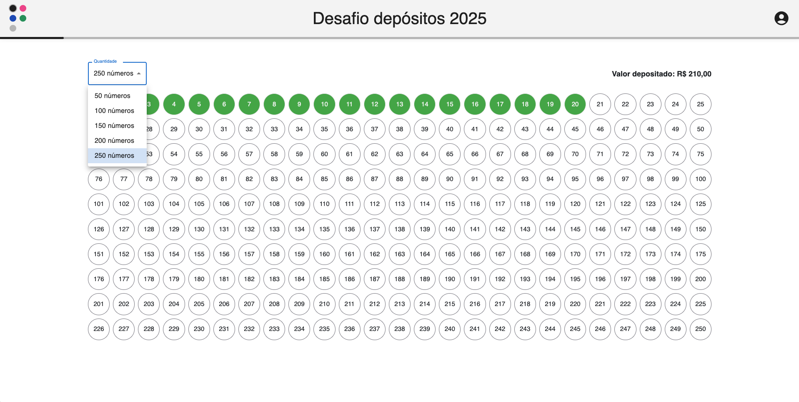
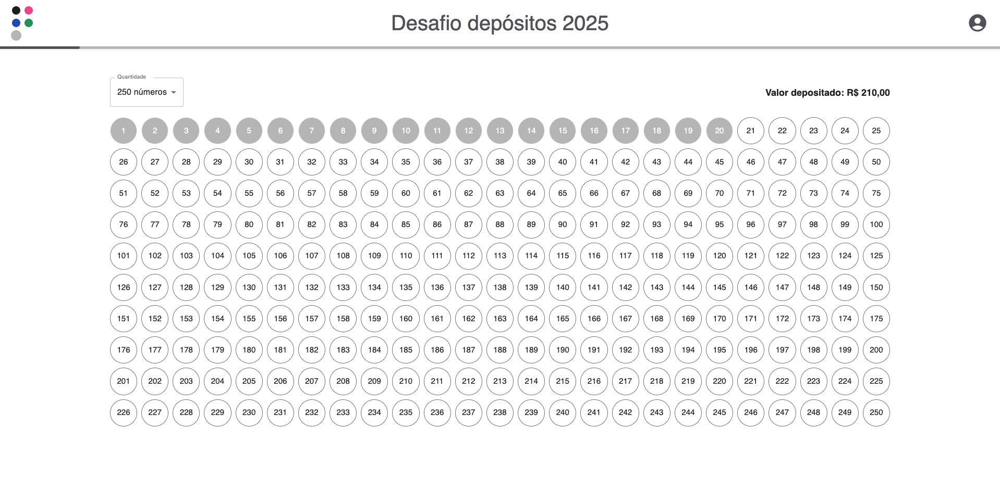

# Savings Challenge 💰

O Savings Challenge é uma aplicação web que transforma o hábito de poupar dinheiro em um desafio divertido e motivador. Escolha seu nível de desafio - desde 50 até 250 depósitos - e acompanhe sua jornada rumo à conquista da sua meta financeira.

### ✨ Como funciona?

1. 🎯 Escolha seu desafio: 50, 100, 150, 200 ou 250 depósitos
2. 💸 Registre cada valor depositado
3. 📊 Acompanhe seu progresso
4. 🏆 Complete todos os números do seu intervalo escolhido

### 🌟 Por que participar do desafio?

- 🎮 Torna o ato de poupar mais envolvente e gamificado
- 📱 Interface intuitiva para registrar seus depósitos
- 📈 Visualize seu progresso em tempo real
- 🎯 Flexibilidade para escolher o nível do desafio
- 💪 Desenvolva o hábito de poupar de forma consistente

### 🎯 Exemplo:
Se você escolher o desafio de 50 depósitos, seu objetivo será fazer depósitos com valores de 1 até 50 reais, não necessariamente em ordem. Cada valor só pode ser usado uma vez, tornando cada depósito uma conquista rumo ao objetivo final!

## 📸 Screenshots

<div align="center">
  
  <div>
    <em>Login</em>
  </div>
</div>

<br/>

<div align="center">
  
  <div>
    <em>Cadastro</em>
  </div>
</div>

<br/>

<div align="center">
  
  <div>
    <em>Recuperar Senha</em>
  </div>
</div>

<br/>

<div align="center">
  
  <div>
    <em>Tela Principal</em>
  </div>
</div>

<br/>

<div align="center">
  
  <div>
    <em>Tela Principal - Tema Rosa</em>
  </div>
</div>

<br/>

<div align="center">
  
  <div>
    <em>Tela Principal - Tema Neutro</em>
  </div>
</div>

## 🛠️ Tecnologias Utilizadas

### Core
- [Next.js 14](https://nextjs.org/) - Framework React com SSR
- [React 18](https://reactjs.org/) - Biblioteca JavaScript para interfaces
- [TypeScript](https://www.typescriptlang.org/) - Superset JavaScript tipado

### Estilização
- [Material UI](https://mui.com/) - Biblioteca de componentes React
- [Bootstrap 5](https://getbootstrap.com/) - Framework CSS
- [Sass](https://sass-lang.com/) - Pré-processador CSS

### Banco de Dados
- [MongoDB](https://www.mongodb.com/) (via Mongoose) - Banco de dados NoSQL

### Formulários e Validação
- [React Hook Form](https://react-hook-form.com/) - Gerenciamento de formulários
- [Zod](https://zod.dev/) - Validação de schemas
- [@hookform/resolvers](https://github.com/react-hook-form/resolvers) - Integração React Hook Form + Zod

### Autenticação e Segurança
- [JWT (JSON Web Tokens)](https://jwt.io/) - Autenticação
- [bcryptjs](https://github.com/dcodeIO/bcrypt.js/) - Criptografia de senhas

### Utilitários
- [Nodemailer](https://nodemailer.com/) - Envio de emails (recuperação de senha)
- [React Hot Toast](https://react-hot-toast.com/) - Notificações de sucesso e erro

## ⚙️ Pré-requisitos

Antes de começar, certifique-se de ter instalado:
- Node.js (versão X ou superior)
- Yarn (ou npm)

## 🚀 Como Executar

1. **Clone o repositório**
```bash
git clone https://github.com/seu-usuario/seu-projeto.git
cd seu-projeto
```

2. **Instale as dependências**
```bash
# Usando Yarn (Recomendado)
yarn

# OU usando npm
npm install
```

3. **Configure as variáveis de ambiente**
```bash
cp .env.example .env.local
# Configure suas variáveis no arquivo .env.local
```

4. **Inicie o servidor de desenvolvimento**
```bash
# Usando Yarn (Recomendado)
yarn dev

# OU usando npm
npm run dev
```

5. Acesse [http://localhost:3000](http://localhost:3000) no seu navegador

## 📋 Funcionalidades

### 🔐 Autenticação e Segurança
- ✅ Cadastro de usuários
- ✅ Login seguro
- ✅ Recuperação de senha via email
- ✅ Proteção de rotas autenticadas

### 💰 Gestão de Depósitos
- ✅ Escolha entre diferentes níveis de desafio (50, 100, 150, 200 ou 250 depósitos)
- ✅ Registro de depósitos individuais
- ✅ Visualização dos números disponíveis e já utilizados
- ✅ Acompanhamento do progresso em tempo real

### 🎨 Personalização
- ✅ Customização das cores da dashboard
- ✅ Interface responsiva e adaptável

### 📊 Dashboard
- ✅ Visão geral dos valores depositados
- ✅ Indicador de progresso visual

---
Desenvolvido com 💜 por Raquel Magalhães
